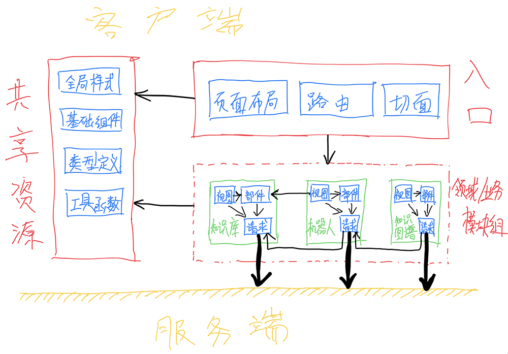

划分目录结构的意义不只是规范文件的存放位置，让文件找起来方便；更重要的是，目录结构实际就是模块拆分的体现，是架构的一部分，其划分方式应具有让开发者把文件放到正确位置的指导作用。

## 常见模式

在一个中后台前端项目中，它的目录结构很可能是这样的：

```text
project/src
   ├── api
   │   └── ...
   ├── assets
   │   └── ...
   ├── components
   │   └── ...
   ├── pages
   │   └── ...
   ├── plugins
   │   └── ...
   ├── router
   │   └── ...
   ├── types
   │   └── ...
   ├── App.vue
   └── main.ts
```

虽然这个示例是一个 Vue 项目，但无论是 React 项目、jQuery 项目或是其他非 Angular 的项目，一般都会采用这种模式。

此模式最大的特点就是「符合直觉」，按照文件的类型或其所扮演的「角色」进行划分：纯资源型文件放到 `assets`，UI 组件的话就放到 `components`，页面的全部扔进 `pages`……

然而，「符合直觉」会带来一些问题——

很容易导致「页面驱动」的思维模式，也就是说，无论是产品需求、UI 设计还是开发，都以页面为中心思考、交流与协作，而不是以领域/业务；带来的后果就是，无论是产品需求、UI 设计还是开发，都不成体系。

页面中容易耦合大量与展示及交互无直接关系的逻辑，并且这些逻辑无法被很好地自动化测试。

通常按菜单结构拆分模块，同一个模块的资源散落在各处，若该模块对应的业务需求有所变动，得到处找要修改的文件，当项目或人员变得复杂时会让代码维护变得更加困难。

模块间的依赖关系混乱，会出现 B 模块页面依赖定义在 A 模块页面文件夹下的 UI 组件的情形，也会有 B 模块页面依赖 A 模块 HTTP API 的同时 A 模块页面又反向依赖 B 模块 HTTP API 的情况。

对于一个业务不是很复杂且协作人数不多的项目来说，这种目录结构也许勉强应付得来；但当业务变得复杂或者协作人数变多时，这个项目很容易走向失控。

## 推荐模式

在使用 Handie 时推荐一种内聚性很高的模式，其目录结构大致如下：

```text
project/src
   ├── domain
   │   └── [domain-specific-module]
   │       ├── views
   │       │   ├── [detail-view]
   │       │   │   ├── [DetailViewComponent].vue
   │       │   │   ├── ...
   │       │   │   └── style.scss
   │       │   ├── [form-view]
   │       │   │   ├── [FormViewComponent].vue
   │       │   │   ├── ...
   │       │   │   └── style.scss
   │       │   └── [list-view]
   │       │       ├── [ListViewComponent].vue
   │       │       ├── ...
   │       │       └── style.scss
   │       ├── widgets
   │       │   └── [domain-specific-widget]
   │       │       └── ...
   │       ├── helper.ts
   │       ├── index.ts
   │       ├── model.ts
   │       ├── repository.ts
   │       ├── typing.ts
   │       └── ...
   ├── entry
   │   ├── aspects
   │   │   ├── http.ts
   │   │   ├── router.ts
   │   │   ├── ...
   │   │   └── index.ts
   │   ├── layouts
   │   │   └── ...
   │   ├── plugins
   │   │   └── ...
   │   ├── routes
   │   │   └── ...
   │   └── ...
   ├── shared
   │   ├── components
   │   │   └── ...
   │   ├── styles
   │   │   └── ...
   │   ├── types
   │   │   └── ...
   │   ├── utils
   │   │   └── ...
   │   └── ...
   ├── App.vue
   └── main.ts
```

相应的模块间依赖关系大概为：



从图中能够明显感受到模块间的依赖关系十分清晰，不像毛线团一样乱糟糟。

### 共享资源

存放在 `shared` 文件夹中的是共享资源，主要是领域/业务无关的类型定义（`types`）、工具函数（`utils`）、全局样式（`styles`）、UI 组件（`components`）等。

建议将使用频率高的类型定义、工具函数分别通过 `types/index.ts`、`utils/index.ts` 导出，然后将路径别名 `@` 配置为 `shared`，这样就可以在 `shared` 文件夹之外使用 `@/types`、`@/utils` 来引入资源。

同时约定只有在 `shared` 文件夹外部依赖内部导出的资源时才可用路径别名 `@`，其他情况都用相对路径，避免因滥用路径别名 `@` 而造成的依赖关系混乱。

在 `components` 文件夹下主要有 `control`、`widget` 和 `renderer` 三个文件夹，分别用来存放并导出[控件、部件和渲染器](https://www.yuque.com/handie/cookbook/qo4k0r)。

### 应用入口

文件夹 `entry` 中存放的是应用初始化所需要的资源，以与表现层相关的为主，如：

- 视图库/框架的运行时插件（`plugins`）；
- HTTP 请求/响应拦截器、路由导航守卫等切面（`aspects`）；
- 页面布局 UI 组件（`layouts`）；
- 路由配置（`routes`）；
- 应用主题配置（`theme`）；
- 沉淀的客户端动作（`actions`）；
- ……

鉴于此，`entry` 文件夹就是「应用入口」。

### 领域/业务模块

在这里，`domain` 文件夹的含义不是经典三层架构中的「领域层」，而是「领域/业务模块组」——先横向按领域/业务拆分模块，再在各模块内部看情况进行纵向分层。

每个领域/业务模块包含以下文件夹或文件：

| 文件夹/文件 | 必需 | 说明 |
| --- | --- | --- |
| `typing.ts` | 否 | 模块级类型定义 |
| `helper.ts` | 否 | 模块级常量、工具函数 |
| `model.ts` | 否 | 对领域模型或业务实体的描述 |
| `repository.ts` 或 `services.ts` | 否 | HTTP 数据请求服务 |
| `widgets` | 否 | 部件 |
| `views` | 否 | 视图 |
| `index.ts` | 是 | 通过模块描述器进行模块定义 |


在 Handie 所带能力的支持下，每个领域/业务模块都可以拆出去形成单独的 NPM 包或 Git 子模块，并能任意移除。

## 文件迁移

改变既有项目的目录结构——

### 从整体到局部

目录结构的调整不仅仅是调整目录结构，实际上是调整模块间的依赖关系，因此无法一时把与领域/业务相关的模块全部调整好，只能先将大类别划好，别的与其他方面的调整同时进行。

首先，在 `src` 文件夹下创建 `domain`、`entry` 和 `shared` 这三个文件夹；然后，根据文件的性质（职责等）分别移入相应的文件夹，如：静态资源、基础组件、工具函数、类型定义等业务无关的公共设施类的移入 `shared` 文件夹，插件、路由配置、布局组件、拦截器等表现层相关且业务无关的移入 `entry` 文件夹，剩余与业务强相关的移入 `domain` 文件夹。

在将与业务相关的文件移入 `domain` 文件夹时，可以先延续原来拆分模块的规则粗略地拆分一下；再在拆分好的模块文件夹下新建个 `repository.ts` 或 `services.ts` 文件将相应的请求相关函数放进去，并把属于模块的页面文件全部放到 `views` 文件夹中。

如果有仅限于当下模块使用的常量、工具函数、类型定义或业务组件，将常量和工具函数放到 `helper.ts` 文件中，类型定义放到 `typing.ts` 文件中，业务组件则放在 `widgets` 文件夹下。

### 从局部到整体

如果觉得从整体目录结构开始改造有点大刀阔斧，影响较大，周期较长，那么可以先不去动整体目录结构，而是从 `src/pages`（有的项目是 `src/views`）文件夹搞起。

这时，就把 `src/pages`（或 `src/views`）看作是上面提到的 `domain`，在做新功能或修改旧功能时，按照上面所说方式新建对应的文件夹与文件或调整相应的目录结构，以达到如下效果：

```text
project/src
   ├── assets
   │   └── ...
   ├── components
   │   └── ...
   ├── pages
   │   └── [domain-specific-module]
   │       ├── views
   │       │   ├── [detail-view]
   │       │   │   ├── [DetailViewComponent].vue
   │       │   │   ├── ...
   │       │   │   └── style.scss
   │       │   ├── [form-view]
   │       │   │   ├── [FormViewComponent].vue
   │       │   │   ├── ...
   │       │   │   └── style.scss
   │       │   └── [list-view]
   │       │       ├── [ListViewComponent].vue
   │       │       ├── ...
   │       │       └── style.scss
   │       ├── widgets
   │       │   └── [domain-specific-widget]
   │       │       └── ...
   │       ├── helper.ts
   │       ├── index.ts
   │       ├── model.ts
   │       ├── repository.ts
   │       ├── typing.ts
   │       └── ...
   ├── plugins
   │   └── ...
   ├── router
   │   └── ...
   ├── types
   │   └── ...
   ├── App.vue
   └── main.ts
```

在这条路径下，可以等把 `src/pages`（或 `src/views`）下的文件都重构完了之后，将 `pages`（或 `views`）改名为 `domain`，再把其他目录结构调整为上文中的那样。
