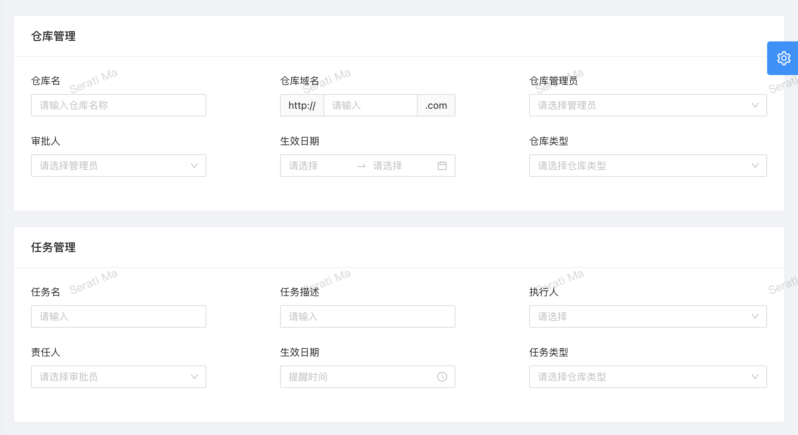

## 部件配置

通过视图描述器的 `config` 属性来配置。

| 配置项 | 值类型/可选值 | 说明 |
| --- | --- | --- |
| `arrangement` | `string` | 对字段进行分组编排，见下面详细说明 |

### `arrangement`

用来对视图中的字段进行分组。

最简单的用法就是将数字用 `|` 分割，如 `3|2|4`，代表把字段分割成 3 行：第一行有 3 个字段，第二行有 2 个字段，第三行有 4 个字段。当指定数量超过实际数量时，视觉上不会出现多余的行；若实际数量多于指定数量，会将剩余字段全部在新的一行中显示。

复杂用法的字符串模式为 `(GT:FC|BP,[BP/BP/BP])`，其中 `GT` 是组标题，`FC` 是字段个数，`BP` 代表响应式断点——大结构就是 `({组标题}:{组内字段布局})`，上面简单用法所示的就是用 `FC` 指定的 `{组内字段布局}` 部分。

圆括号 `()` 和分号 `:` 构成了字段的分组，用于[下图中的场景](https://preview.pro.ant.design/form/advanced-form)：

图中的分组可以表示为 `(仓库管理:{组内字段布局})(任务管理:{组内字段布局})`，`{组内字段布局}` 部分通过 `|` 进行行的划分，即哪些字段显示在一行内。

如果直接用 `FC`，就是指定一行内字段的个数，这种方式不能设置每个字段的宽度，按照指定个数等分。若要针对单个字段进行宽度设置，需要通过 `BP`，即响应式断点的方式指定。

在用 `BP` 指定字段布局时，需要用 `,` 分割字段，`BP` 是 `{尺寸}-{所占栅格数}` 形式的字符串。当一个字段要在不同尺寸占用不同栅格数时，要用 `[BP/BP/BP]` 的形式指定，不同尺寸所占栅格数用 `/` 分割。

其中，`{尺寸}` 可以为 `xs`、`sm`、`md`、`lg`、`xl`，`{所占栅格数}` 是以 [24 栅格系统](https://petals.fxxk.design/controls/grid/)为基准的数字。
